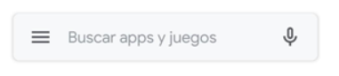
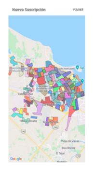
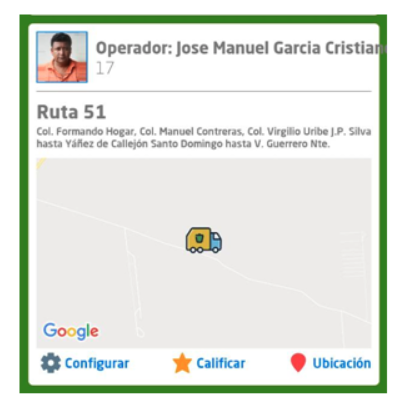

# [Veracruz Puerto Limpio](https://play.google.com/store/apps/details?id=com.limpiapublicaveracruzd&hl=es_MX)

Veracruz Puerto Limpio es una aplicación móvil que fue desarrollada mediante el trabajo, colaboración y participación de la ciudadanía con la información proporcionada por el gobierno municipal, en específico de la Dirección de Servicios Públicos municipales.

  - [Acerca de Veracruz Puerto Limpio](#Acerca-de-Veracruz-Puerto-Limpio)
   - [Guía de instalación](#Guía-de-instalación)
     - [Dispositivos androids](#Dispositivos-android)
   - [Guía de usuario](#Guía-de-usuario)
	    - [Usar por primera vez](#Usar-por-primera-vez)
     - [Para crear suscripción en una zona](#Para-crear-suscripción-en-una-zona)
     - [Para activar o desactivar notificaciones](#Para-activar-o-desactivar-notificaciones)
     - [Para iniciar sesión](#Para-iniciar-sesión)
     - [Si olvidas tu contraseña](#Si-olvidas-tu-contraseña)
   - [Autores](#Autores)
     
     
	

### Acerca de Veracruz Puerto Limpio
El municipio de Veracruz, se ubica en el estado con el mismo nombre, al centro Este de la República Mexicana, en el golfo de México, y se caracteriza por diversos sucesos históricos acontecidos en dicho lugar; es considerado el municipio más antiguo de América Continental fundado hace 500 años.
 
De igual forma, es uno de los municipios con mayor desarrollo urbano en México, principalmente porque en dicho lugar se encuentra el puerto marítimo más grande del país, además que es el más poblado del estado ya que actualmente habitan más de 600,941 personas (de los cuales 285,292 hombres y 315,649 mujeres), en una extensión territorial 247.9 km2 y una superficie urbana de 115.6 km²,  integrada por más de 200 colonias, con una densidad de población de 2,379 hab/km², una densidad urbana 4,794 hab/km², con una tasa de crecimiento media anual de la población 1.9 quinquenal (0.2%), lo que representa un índice de urbanización de 93.1 sobre el total de su territorio y contando con 184,242  viviendas particulares habitadas (VPH) lo que representa 73.7% y 78,820 negocios o establecimientos que representa el 26.3% restante. 
 
Sin embargo, uno de los principales retos que presenta la ciudad es el relacionado con la prestación del servicio público de recolección y disposición final de los residuos sólidos urbanos, el cual además de generar afectaciones ambientales, también genera problemas principalmente en la temporada de lluvias, ya que ocasiona se tapen drenajes, alcantarillados, tragatormentas y demás infraestructura relacionada con la recolección y descarga de aguas pluviales. 
 
Por lo anterior, con el objetivo de mejorar dichos servicios y atender estos retos, la actual administración municipal se propuso como objetivo desarrollar prácticas e innovadoras  basadas en el uso de las tecnologías, capaces de dar solución a problemas de nuestra ciudad, mediante el aprovechamiento de herramientas que sean accesibles a la población, y que las dependencias municipales abran sus procesos a la innovación cívica para generar datos abiertos y la creación de un ecosistema de emprendedores cívicos.
 
Dicho objetivo debía alcanzarse bajo un enfoque de corresponsabilidad con la ciudadanía mediante la colaboración y participación de las personas y mediante la apertura de datos públicos como lo fueron la información de los GPS colocados en las 50 unidades recolectoras, a través de una API pública para la explotación de los mismos. 
 
Como estrategia, se lanzó un ejercicio de participación ciudadana en el que se vincularon instituciones educativas de nivel superior y al que se le denominó “Reto Público #1 Servicios Públicos”, el cual convocó a personas interesadas en generar soluciones innovadoras a través de prácticas tecnológicas.
 
El equipo ganador desarrolló en conjunto una solución a través de la App Veracruz Puerto Limpio, que es una aplicación tecnológica que coadyuva a mejorar la experiencia de la ciudadanía que requiere de los servicios de recolección de los residuos sólidos urbanos, mediante la descarga de la misma en play store para teléfonos android (próximamente a través de la tienda de app store para teléfonos con IOS). 
 
Una vez descargada las personas deben realizar un sencillo registro para acceder a ella y con ello recibir un servicio personalizado, asignando una ruta adecuada, dependiendo de la ubicación proporcionada por el ciudadano. 
 
La suscripción se realiza a través  de la proporción de la ubicación georeferenciada de la persona que permite determinar la ubicación actual; hecha dicha acción el usuario de la App podrá visualizar en tiempo real las rutas y recolecciones de los camiones recolectores. 
 
Además las personas usuarias de la herramienta digital podrán contar con la información necesaria para sacar sus residuos sólidos urbanos en el día y el horario exacto, evitando hacerlo cuando no es propicio y evitando problemas derivados del mal manejo y disposición de dichos residuos. 
 
Los usuarios podrán visualizar las rutas cercanas, los datos de las unidades y quienes las conducen, con el objetivo de promover también la cercanía entre la ciudadanía y los operadores de las unidades automotores recolectoras.
 
Esto a su vez permite que la ciudadanía pueda calificar a los servidores públicos y el servicio brindado ya que la App cuenta con un sistema de calificaciones y recepción de comentarios para que la ciudadanía exprese su sentir para dejar comentarios.
 
La aplicación cuenta con una sección de notificaciones, donde los ciudadanos podrán inscribirse y con ello asegurar que la app les avise cuando el camión recolector se acerque a la sección a la que registraron (actualmente trabajan 50 camiones recolectores que cubren 100 rutas 3 turnos distintos).
 
Con la aplicación de Veracruz Puerto Limpio promovemos:
 
Mayor transparencia en el otorgamiento del servicio de recolección de residuos sólidos urbanos;
Eficientar las rutas y la movilidad de los camiones para generar ahorros en consumibles;
Tener mayor control sobre las unidades y evitar situaciones que propicien actos indebidos de los trabajadores municipales;
Mantener a la ciudadanía informada sobre el servicio público;
Evitar que la ciudadanía saque los residuos cuando ya haya pasado el camión recolector y con ello evitar que lleguen a coladeras, targeas, drenajes o tragatormentas;
Mejorar la visión de la ciudadanía demostrando que en conjunto podemos resolver nuestros retos ciudadanos.
 
 
## Guía de instalación
  	Requerimientos
*        Dispositivos Android desde versión kit kat
*        Mínimo de espacio requerido 80 mb
*        Conexión de red

#### Dispositivos android
1.	Entrar Google Play Store

2.	En la barra de búsqueda, escribir “Veracruz puerto limpio”

3.	Seleccionar la app con la siguiente  imagen 

4.	Seleccionar el botón “instalar”

5.	Esperar que la app finalice su instalación

## Guía de usuario
 
#### Usar por primera vez

 1.	Concede los permisos de ubicación y almacenamiento

 2.	Ingresa tu correo electrónico, tu nombre y crea una contraseña

 3.	Selecciona el botón “Registrarse”

#### Para crear suscripción en una zona
 4.	Entra en el apartado “Suscripciones”

  

 5.  Selecciona “crear suscripción” (necesitas activar tu ubicación)

 6.	En el mapa selecciona el área de tu interés, la cual está delimitada por un color
 
  

 7.	Selecciona “volver” para ver si la unidad de limpieza ya inició su turno y poder ver los datos del operador y de la unidad

  
  
#### Para agregar un área diferente
 8.	Selecciona “crear suscripción” y selecciona la de tu preferencia.

#### Para activar o desactivar notificaciones
 9.	Selecciona “Configurar” en la ruta en la que deseas activar o desactivar notificaciones (están activas por default)
10.	Presiona el botón a lado de NOTIFICACIONES (verde=notificaciones activadas, gris=sin notificaciones)
11. Para cancelar una suscripción, sigue el paso 8 y selecciona “Cancelar suscripción”

#### Para iniciar sesión
 12. Ingresa tu correo y contraseña, selecciona “iniciar sesión”

#### Si olvidas tu contraseña
 13. Selecciona “olvidé mi contraseña”
 14. Ingresa tu correo electrónico
 15. Te llegará un correo, da clic en el link que te mandan
 16. Ingresa una contraseña nueva
 
Si quieres ver los camiones recolectores que están cerca de ti, puedes acceder dando clic en el ícono del mapa que aparece en la parte superior izquierda de tu dispositivo, la ubicación tiene que estar activa.

Esta aplicación cuenta con un apartado de “noticias/avisos”, para ingresar selecciona el ícono de la campanita en la parte inferior de tu dispositivo.

Tu aplicación también cuenta con un área de recomendaciones, en donde podrás ver eventos que se están llevando a cabo o eventos futuros, para acceder aquí, da clic en el ícono del foco ubicado en la parte posterior derecha de tu dispositivo

 
 ### Guía de instalación
---
#### Pre-requisitos
+ Instalación de Node.js
     Necesitamos descargar Node.Js desde su pagina oficial  [puedes descargarlo aquí](https://nodejs.org/es/download.

     Solo debemos escoger el sistema operativo:
     + Windows 32-bit , 64-bit
     + MacOs
     + Código fuente

  La versión actual: 12.16.3(includes npm 6.14.4).
   Para probar que se instalo correctamente Node.Js. Abrimos una consola cmd y   ejecutamos el siguiente comando:

  `node -v`

     Este comando retornará la versión actual de Node.js. 
     Para  verificar la versión del gestor de paquetes NPM instalada, ejecutamos el comando:

 `npm -v`

     Este comando retornará la versión actual de NPM. 

+ Debes instalar Androi Studio, puedes hacerlo en este ][link](https://developer.android.com/studio).
+ También debes descargar xcode , puedes registrarte en esta [página](https://idmsa.apple.com/IDMSWebAuth/signin?appIdKey=891bd3417a7776362562d2197f89480a8547b108fd934911bcbea0110d07f757&path=%2Fdownload%2F&rv=1) para descargarlo.

#### Instalación
Empezaremos por clonar el repositorio:

`git clone https://github.com/AyuntamientoVeracruz/App-Puerto-Limpio.git`
`cd App-Puerto-Limpio`

Instalamos el proyecto y actualizamos las librerías necesarias. Una vez dentro de la carpeta del proyecto App-Puerto-Limpio ejecutamos el siguiente comando:

`npm install`

#### Uso
Para corres el proyecto en entorno de desarrollo ejecutamos el siguiente comando:

`npm start`

¡Y listo! El proyecto se iniciará en algun puerto  de tu navegador predeterminado y se actualizará con cada cambio que realices.

### Cómo contribuir
---
Los proyectos que trabajan con  código abierto te permiten que el código fuente y toda la documentación sean libres para consulta. Por lo que puedes contribuir en este o cualquier otro proyecto para mejorar, corregir o sugerir ideas. 
Puedes encontrar maneras de contribuir a los proyectos de código abierto en GitHub que te parezcan relevantes.

Si hay un tema en particular que te interese, visita `github.com/topics/<topic>`. Para obtener más información, consulta  [Buscar repositorios](github.com/topics/<topic>.) o visita nuestra página [Aquí](https://help.github.com/es/github/getting-started-with-github/finding-ways-to-contribute-to-open-source-on-github).

 
 
 
## Autores

[Luis Enrique Medina Galván](https://github.com/Liosenri)

David Rodríguez González
 
